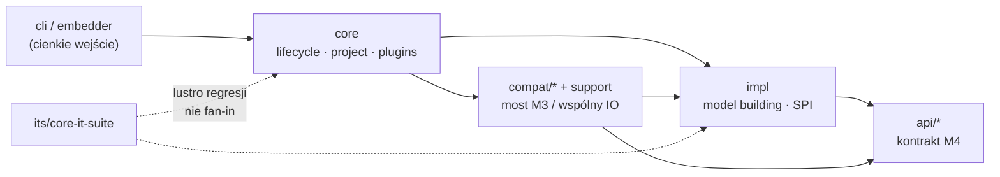

# Project Map — apache/maven

| | |
|---|---|
| **Źródła** | [artifact-1-territory](./artifact-1-territory.md) · [artifact-2-structure](./artifact-2-structure.md) · [artifact-3-contributors](./artifact-3-contributors.md) |
| **Okno** | 2025-10-09 → 2026-10-09 (12 miesięcy) |
| **Cel** | Onboarding: gdzie żyje system, co boli, od czego czytać, kogo zapytać |

---

## 1. TL;DR

Apache Maven to narzędzie do budowania projektów wokół POM-u. W tym oknie repo to przede wszystkim **domykanie Maven 4**: budowanie modelu, runtime (reactor / lifecycle / pluginy) i publiczne API — a nie Dependabot ani `its/`.

Warstwy trzymają się przewidywalnego DAG-a; realne ryzyko siedzi w mostach M3↔M4 i w wąskich gardłach runtime, nie w „gorących” kampaniach CLI.

Praca skupia się w `impl/maven-impl` → `impl/maven-core` → ITS → `impl/maven-cli` (po filtrze botów). Boli: edge case’y modelu (profile / parent / CI-friendly), splątany lifecycle w core oraz każdy ruch w publicznym `api/maven-api-*` (blast w reactorze + **unknown** ekosystem pluginów).

---

## 2. Teren

### Duża odpowiedzialność vs peryferia

| | Stałe centrum | Kampanie (gł. 2026 Q2–Q3) | Peryferia / wygasające |
|---|---------------|---------------------------|-------------------------|
| **Co** | Model building + core runtime | `mvnup`, concurrent lifecycle, consumer POM, polish API M4 | klasyczny `compat/maven-model` sam, `.mvn/`, stary layout `maven-*` |
| **Gdzie** | `impl/maven-impl`, `impl/maven-core` | `impl/maven-cli` (`mvnup`), `BuildPlanExecutor`, API `.mdo` | poza ścieżką startu albo już wycięte (np. `maven-executor` → osobny repo) |

**ITS** (`its/core-it-suite`) jest lusterkiem regresji M4: wysoki ruch plikowy i % fix, ale **nie** centrum produktu — struktura nie daje mu fan-inu.

### Głębokie vs płytkie

- **Płytkie wejścia** (niski fan-in): `maven-cli`, `maven-embedder`, `maven-compat` (liść) — bezpieczniejsze lokalnie, byle nie psuć bootstrapu.
- **Głębokie / load-bearing**: `maven-api-xml`, `maven-support`, `maven-api-*`, legacy `maven-model` / `artifact` (wysoki Ca typów); na ścieżce runtime mimo niskiego Ca: **`maven-impl`**, **`maven-core`**.
- **Mylące „huby” z gita**: `mvnup`, root `pom.xml` / Dependabot, gęste fixy w `its/` — aktywność ≠ strukturalna waga.

### Aktywność w czasie

Spokój 2026-Q1, skok V–IX 2026 (Maven 4 polish). Około ⅓ kept commitów ma AI co-author — liczone w aktywności, nie zastępuje wiedzy domenowej. Ranking modułów po filtrze szumu: **impl → core → ITS → cli → api-core**.

---

## 3. Realne powiązania

### Co zmienia się razem (git co-change)

Źródło: historia gita (artifact-1), po wycięciu mega-commitów i botów.

- **Trójka decyzyjna:** `api/maven-api-core` ↔ `impl/maven-core` ↔ `impl/maven-impl` (API ~46–49% zmian idzie z impl/core).
- **Legacy model:** `compat/maven-model-builder` ↔ `impl` (**~88%**) — stary builder nie żyje osobno.
- **Runtime mosty:** `compat/maven-embedder` ↔ `cli` (~81%); `resolver-provider` ↔ `impl` (~86%).
- **`mvnup`:** słabo sprzężony z core/modelem — kampania lokalna w cli (+ czasem IT).
- **Root `pom.xml`:** szeroki breadth (~18 modułów), głównie **ręczny** hub wersji/reactora — nie generator; niski dramat produktowy.

### Warstwy i importy (jdeps / dependency:tree)

Źródło: graf bytecode + POM (artifact-2). **Cykle modułów: brak.**

| Granica | Stan |
|---------|------|
| `api/*` ↛ `impl` / `compat` | Trzyma |
| `maven-impl` → api, ↛ core/cli/compat | Trzyma (SPI + qualified exports) |
| `core` / `cli` → api + impl | Oczekiwany DAG w dół |
| `core`/`cli` → `compat/*` | **Most M3** — typy legacy w powierzchni (widać też w `-apionly`) |
| `compat` / embedder → core+impl | Most w górę, liść (nie cykl) |

Kierunek: **`api ← impl ← core ← cli`**, równolegle `compat/*` + `maven-support` (wspólny v4 IO dla M4 i M3).

**Cykle pakietowe** (wewnątrz, nie między JAR-ami): `maven-core` (lifecycle ↔ project ↔ execution ↔ plugin) oraz `model.building` jako hub w model-builder — stąd „mały” refaktor lifecycle rzadko zostaje w jednym pakiecie.

### Unknown / poza grafem

- **DI / ClassRealm / refleksja / SPI runtime** — jdeps tego nie widzi → `unknown`, nie „brak powiązań”.
- **Zewnętrzni konsumenci API** (pluginy ekosystemu) — poza reactor → `unknown` (japicmp nie robiony).
- Część `maven-support` / model z **`.mdo` / codegen** — wspólna zmiana przez regenerację jest tańszym sprzężeniem niż ręczna edycja obu światów naraz; drift kontraktu nadal boli.

### Wygląda groźnie, ale nie jest

| Sygnał | Dlaczego nie strefa ryzyka |
|--------|----------------------------|
| Gęste fixy / ruch w `its/` | Lustro regresji M4, nie fan-in produktowy |
| Root POM + Dependabot na TOP bez filtra | Szum wersji / CI; po filtrze centra bez zmiany |
| `mvnup` + słowa „toolchain” w plikach | Contained w cli (Ca≈1); ≠ codzienny runtime toolchain |
| `maven-compat.jar` Ca=0 | Liść / bridge; load-bearing są support, model, model-builder |
| Niski Ca `impl` / `core` | Wąskie gardło ścieżki startu — ważne *mimo* niskiego Ca |
| Mega docs / license / NIO2 IT | Jednorazowe kampanie plikowe |

---

## 4. Strefy ryzyka

Każda strefa: ≥2 niezależne sygnały. Nazwy produktowe; lokalizacja w kodzie osobno.

### 1. Budowanie modelu POM (profile, parent, CI-friendly `${revision}`)

**Gdzie:** `impl/maven-impl` (`DefaultModelBuilder` i pipeline), most `compat/maven-model-builder`, styki z `DefaultProjectBuilder` w core.

**Dlaczego:** #1 aktywność + wysoki % fix *oraz* na każdej ścieżce runtime (cli/core/compat/embedder) *oraz* ~88% co-change z legacy builderem — edge case’y M4 (reverty wokół CI-friendly / consumer).

### 2. Lifecycle, reactor i świat pluginów

**Gdzie:** `impl/maven-core` (lifecycle / project / plugin realm; `BuildPlanExecutor` dla concurrent).

**Dlaczego:** stałe #2 w territory + gęste cykle pakietowe + Ce wysokie i typy M3 w powierzchni API core — „lokalna” zmiana lifecycle tyka project/plugin; gwarancje concurrent DAG vs klasyczny lifecycle = unknown.

### 3. Publiczny kontrakt API M4 (Session, services, SPI)

**Gdzie:** `api/maven-api-core` (i sąsiednie `api/maven-api-*`, `.mdo`).

**Dlaczego:** silne co-change z impl/core + Ca≈11 w reactorze; cały JAR to powierzchnia — usunięcia/sygnatury bolą od razu; wpływ na pluginy zewnętrzne = **unknown**.

### 4. Most M3↔M4 i wspólny IO modelu

**Gdzie:** `compat/*` (zwłaszcza model-builder, embedder, artifact), `impl/maven-support`.

**Dlaczego:** jdeps pokazuje świadome mosty (core→compat nawet w `-apionly`) + `maven-support` ma wyższy fan-in niż `maven-impl` — jedna zmiana readers/writers uderza w M4 i legacy naraz (część generowana z `.mdo`).

### 5. Zaufanie do zewnętrznego POM / settings / Resolver

**Gdzie:** settings builders (`impl` + compat), walidacja coords/metadata, `resolver-provider` ↔ impl.

**Dlaczego:** aktywność w warstwie config/credentials w territory + napięcie kontraktu w PR (`#12948` vs unmerged `#13030`) + osobna linia ekspercka (Resolver / hardening); pinning transportu miał reverty — wpływ enterprise = unknown bez Deep Focus.

---

## 5. Kogo zapytać

Mapa ludzi jest **Deep Focus na `impl/maven-impl`** (artifact-3). Dla innych stref — ekstrapolacja tematyczna + struktura; historia ≠ ownership ani dostępność.

| Strefa | Punkt wejścia | Alternatywa |
|--------|---------------|-------------|
| Budowanie modelu / profile / parent / CI-friendly | **Guillaume Nodet** | Goutam Adwant (inference / BOM / SPI); PR `#13112`, `#13104`, trio `#12317`→revert→`#12323` |
| Trust external POM / walidacja coords | **Sylwester Lachiewicz** | Nodet; czytać `#12948` i napięcie `#13030` |
| Resolver / walidacja artifactów / session↔repo | **Tamas Cservenak** | `#12520`, `#11238` |
| Sources / paths / JPMS messaging | Martin Desruisseaux | `#11322`, `#11551` |
| Lifecycle / concurrent / plugin realm | *(brak mapy ludzi dla core)* — zacznij od maintainerów core + PR-ów lifecycle z territory | Deep Focus jak dla impl |
| Publiczne API / SPI | Nodet + Adwant (przenosiny SPI `#12274`) | japicmp / ekosystem = unknown |

Koncentracja w impl (Nodet ~53%, TOP3 ~67%) przy małej liczbie committerów ASF jest **oczekiwana**, nie automatyczny alarm bus-factor — jest druga linia tematyczna.

---

## 6. Pierwszy dzień

Uporządkowana ścieżka (szeroki obraz → huby → mosty). Pliki sprawdzone na drzewie roboczym.

1. `api/maven-api-core/src/main/java/org/apache/maven/api/Session.java` — kontrakt sesji M4 (punkt odniesienia dla reszty).
2. `api/maven-api-core/src/main/java/org/apache/maven/api/services/` — powierzchnia usług (to, co boli przy breaking).
3. `impl/maven-impl/src/main/java/org/apache/maven/impl/model/DefaultModelBuilder.java` — hub modelu (#1 plik w territory).
4. `impl/maven-core/src/main/java/org/apache/maven/project/DefaultProjectBuilder.java` — granica model → project / reactor.
5. `impl/maven-core/src/main/java/org/apache/maven/lifecycle/internal/concurrent/BuildPlanExecutor.java` — concurrent lifecycle (kampania Q3).
6. `impl/maven-cli/src/main/java/org/apache/maven/cling/invoker/LookupInvoker.java` — cienkie wejście CLI / bootstrap.
7. `impl/maven-core/src/main/java/org/apache/maven/internal/transformation/impl/DefaultConsumerPomBuilder.java` — consumer POM (M4 polish).
8. `compat/maven-model-builder/src/main/java/org/apache/maven/model/building/DefaultModelBuilder.java` — legacy twin; widać, dlaczego compat nadal żyje z impl.

Potem (opcjonalnie, przed zmianą w modelu): PR-y z artifact-3 §4 — zwłaszcza `#12948`, `#13112`, `#12274`, `#13104`.

**Nie zaczynaj od:** `its/core-it-suite` jako „źródła prawdy”, `mvnup` / `PluginUpgradeStrategy`, ani root `pom.xml` Dependabot — to sygnały pomocnicze albo fałszywe centra.

---

## 7. Ograniczenia

- **Okno:** 12 miesięcy aktywności i dyskusji; starszy dług i decyzje sprzed okna mogą być niewidoczne.
- **Metoda:** synteza trzech artefaktów (git + `gh` + jdeps/POM) — **bez** pełnego czytania kodu pod ranking; ścieżki w §4–§6 zweryfikowane istnieniem w repo.
- **Graf zależności:** tylko Java bytecode/POM w zbudowanych JAR-ach reactora. Brak grafu dla DI, ClassRealm, refleksji, SPI ładowanego w runtime → **`unknown`**, nie „brak sprzężeń”.
- **Ludzie:** Deep Focus tylko dla `maven-impl`; ranking commitów ≠ formalny ownership / dostępność / zatrudnienie.
- **Mapa NIE mówi:** binary/behavioral break dla ekosystemu pluginów; kompletności gwarancji concurrent lifecycle; pełnego modelu zaufania settings↔resolver; harmonogramu usuwania `maven-compat`; stanu spoza tego repo (np. `maven-resolver` jako osobny projekt).

Następny sensowny krok to Deep Focus na unknowns ze stref 1–2 i 5 — nie kolejny szeroki skan `its/` ani Dependabot.
